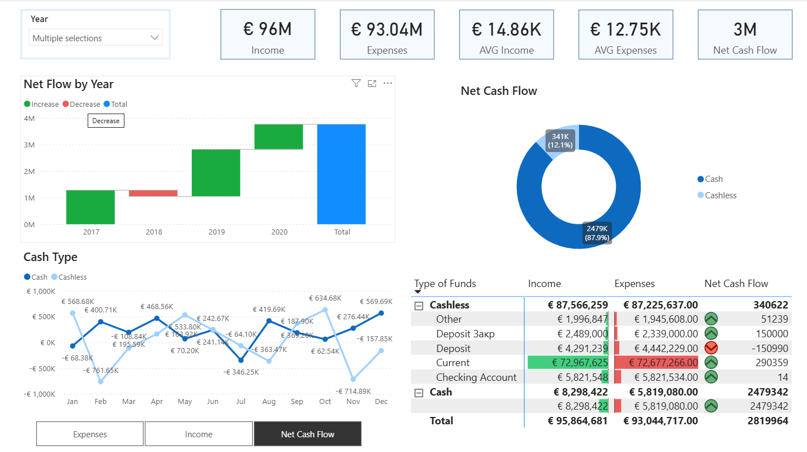
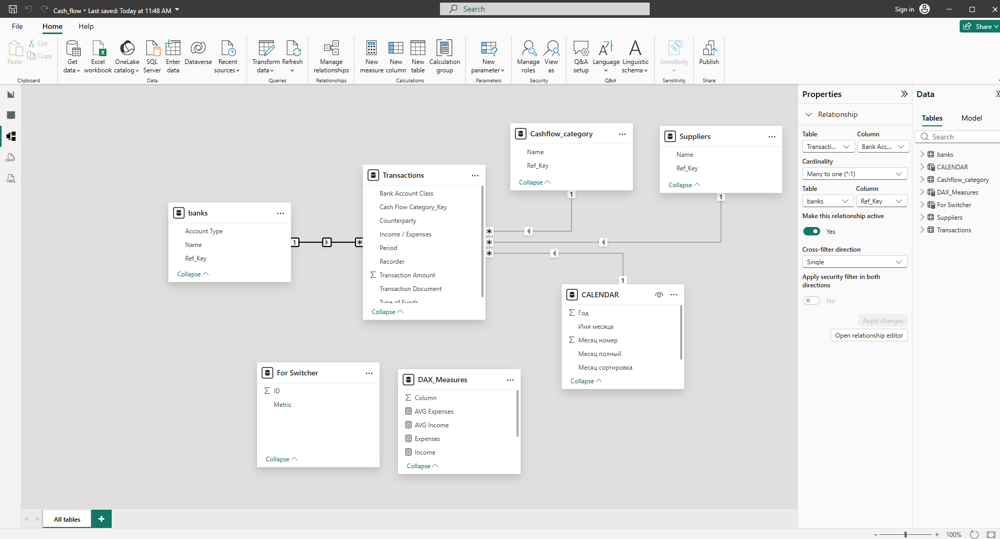
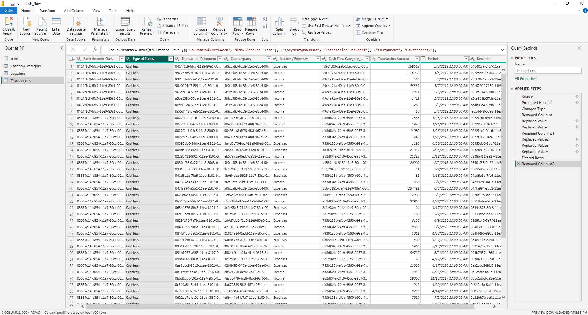

# Power BI Cash Flow Analytics Dashboard

## Project Overview

This project is an interactive Power BI dashboard created for cash flow analysis and financial transaction monitoring.

The dashboard helps analyze income, expenses, net cash flow, transaction trends, payment methods, and fund types across different periods.

The project includes data cleaning in Power Query, data modeling, DAX calculations, and interactive dashboard visualizations.



---

## Business Goal

The goal of this project was to build a centralized financial dashboard for monitoring company cash flow performance and identifying trends in income and expenses over time.

The dashboard was designed to support financial analysis and provide a clear overview of operational cash movements.

---

## Dataset

The dataset contains financial transaction data, including:

- bank accounts
- suppliers / counterparties
- cash flow categories
- transaction records
- income and expense types
- fund types
- financial periods

The project uses multiple CSV files that were transformed and connected inside Power BI.

---

## Data Model

The data model was built using a star-schema-like structure with relationships between transactions, banks, suppliers, cash flow categories, and calendar tables.

The model includes:

- Transactions fact table
- Banks dimension table
- Suppliers dimension table
- Cash Flow Category dimension table
- Calendar table
- DAX measures table



---

## Power Query & Data Preparation

The data was cleaned and transformed in Power Query before creating the dashboard.

Main transformation steps included:

- changing data types
- renaming columns
- filtering rows
- replacing values
- preparing relationships
- organizing financial categories
- creating a calendar table



---

## Dashboard Features

The dashboard includes:

- Total Income
- Total Expenses
- Average Income
- Average Expenses
- Net Cash Flow
- Cash vs Cashless analysis
- Net flow by year
- Monthly cash flow trends
- Fund type comparison
- Financial performance monitoring

---

## Key Insights

- Cashless transactions generated the largest share of net cash flow.
- Overall income exceeded expenses across the analyzed period.
- Net cash flow showed positive growth after 2018.
- Monthly cash flow fluctuated significantly throughout the year.
- Certain fund types contributed more strongly to overall financial performance.

---

## Tools Used

- Power BI
- Power Query
- DAX
- Data Modeling
- Data Visualization
- Financial Analytics

---

## Project Structure

```text
powerbi-cashflow-analytics-dashboard/
│
├── dashboard/
│   └── cashflow_dashboard.pbix
│
├── data/
│   ├── banks.csv
│   ├── cashflow_categories.csv
│   ├── suppliers.csv
│   └── transactions.csv
│
├── images/
│   ├── dashboard_overview.png
│   ├── data_model.png
│   └── power_query_transactions.png
│
└── README.md